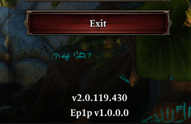

!!! info ""
    Only version 2.0.119.430 (Steam release) of the game is supported - the GOG equivalent might work, but is untested.

[Latest version download (v0.9.0.0).](TODO)

Ep1p can be installed or removed at any point and does not require starting a new playthrough.

Installation:

1. Unzip the archive.
2. Place `DXGI.dll` in the game's `Shipping` folder, so that it is in the same folder as `EoCApp.exe`.
3. Copy the contents of the `Data` folder into the game's `Data` folder, so that the `.swf` files end up in `C:\Program Files (x86)\Steam\steamapps\common\Divinity Original Sin Enhanced Edition\Data\Public\Game\GUI` (or equivalent relative path).

If step 2 is done correctly, you will see "Ep1p" written near the version number in the game's main menu.

To verify you did step 3 right, open the gameplay settings menu, scroll to the bottom and verify that the UI's background displays correctly.

!!! warning ""
    If playing multiplayer, the following settings need to be the same for all players:

    - "Always grant XP to dead party members"
    - "Unlimited Carry Weight"
    - "Unlimited Equipment Durability"
    - "Shared Lucky Charm"

Due to the mod's nature of patching game code, it's possible there may be bugs that lead to crashes. Please report any in [#epipeline](https://discord.gg/SevYmQc573); as a temporary workaround in such cases, you may try disabling any troublesome features in the [settings menu](#settings-menu).

To uninstall, remove all files added by the mod.

See the [FAQ](faq.md) for answers to some common questions.