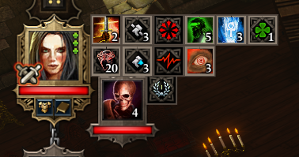

# Ep1p

Ep1p is the spiritual prequel to [Epip](https://pinewood.team/epip), bringing numerous QoL & UI adjustments to *Divinity: Original Sin Enhanced Edition*, such as more informative healthbars, a longer hotbar, shared loremaster & lucky charm, engine bug fixes and more.

## Links
- [Download and installation instructions](download.md)
- [Features overview](#features)
- [FAQ](faq.md)

Credits & Special Thanks

Special thanks to:

- Norbyte, without whose reverse-engineering mentoring and motivation this project likely would've taken years longer to develop.
    - Ep1p also makes use of code from his DOS2 extender as boilerplate.
- The Epic Encounters community, for keeping interest in DOS1 alive.
    - Special thanks to Ameranth & bleah11 for the motivation to look into the scripting engine bugs.

## Features
Ep1p features various QoL & UI improvements and fixes, most of them being configurable from the in-game [settings menu](#settings-menu).

### Target health bar UI
The health bar UI that appears when hovering over characters has received numerous improvements, mainly to reduce the amount of trips to the examine UI:

- Exact character vitality amounts are now shown.
- Character resistances are now shown.
- Statuses now display in 2 columns, like in DOS2 - making better use of screen space and making them less likely to overflow the screen.

### Hotbar
An option to use a longer hotbar that displays 20 slots at once has been added (*"Extended Hotbar"* setting).

Additionally, a lock button has been added; when enabled, the contents of the slots cannot be dragged out.

In addition to this, a bug has been fixed in the UI that made dragging slots out far easier than was intended - you now need to move the cursor 10 pixels instead of just 1 pixel to start dragging, solving the infamous accidental dragging issues.

These last two features are available when the extended hotbar is disabled as well.

!!! info ""
    Note that the maximum amount of hotbar slots (50) remains unchanged - as such, the extra 10 slots to the right of the third row are not usable.

### Player portraits UI
The status bars by the player portraits on the right will now wrap once a player character has >6 statuses, reducing the likelihood of them obscuring the center of the screen.

### Examine UI
A hotkey to open the examine UI for characters has been added, defaulting to `T`. This hotkey is usable even in situations where you normally wouldn't be able to bring up the context menu, such as when it is not your turn.

Additionally, it's possible to configure the UI to show all information regardless of loremaster, or use the [highest loremaster of the party](#shared-civils).

!!! info ""
    Hotkeys currently cannot be modified in-game, but you can change them by [editing the settings file](faq.md#can-i-rebind-the-new-hotkeys).

### Shared "civils"
Settings have been added to "share" loremaster and lucky charm scores across the party for the purposes of examining and looting respectively, like in DOS2. Mods that add scripted aspects to these stats are unaffected.

There is currently no visual feedback for this.

### Other features
- **Auto-identify**: marks items as identified when they're generated.
- **Unlimited carry weight**: prevents characters from gaining the "overencumbered" status
- **Unlimited equipment durability**: prevents weapons and armor from losing durability.
- Dead party members in Tactician & Honour modes can receive experience.
- Showing world tooltips for all containers (barrels, crates, etc.)
    - Unfortunately, clicking their tooltips will still cause your character to attempt to pick them up rather than loot them.
- The maximum camera zoom can be adjusted.
    - Note that render distance limits are not adjusted; as such, at high camera distances, you may see features such as shadows or surfaces disappear.
    
### Bug fixes
Some bugs in the game have had workarounds made for them:

- Added a workaround for the scripting engine breaking "randomly", most infamously during the tutorial dungeon while using Epic Encounters.
    - This appears to be the bug that caused the door and pressure plate at the end of the tutorial to not work, as well as random mechanics breaking and torches not getting toggled when interacting with them, fixable only by fully restarting the game.
    - If you disable this workaround in the settings menu, Ep1p will still notify with a message box you when it detects the issue has occurred.
- Added a workaround for the skill range indicator effects not appearing if you begin casting a skill while the caster is not on screen.

### Settings menu
The gameplay settings menu has new options that allow you to configure Ep1p's various features.

!!! warning ""
    Changing settings requires the game to be fully restarted - don't wait to do so, or you might run into crashes.

!!! warning ""
    If playing multiplayer, the following settings need to be the same for all players:

    - "Always grant XP to dead party members"
    - "Unlimited Carry Weight"
    - "Unlimited Equipment Durability"
    - "Shared Lucky Charm"

Settings are stored in `Ep1pSettings.json` within the `Shipping` folder, after modifying them once in-game.

### Modding improvements
A few changes have been made to help with regular modding:

- Osiris logging can be enabled, which will log to `osiris.log` in the `Shipping` folder, similar to DOS2.
- Story patching can be forced to facilitate testing scripting changes on existing saves.
    - Note that it [is possible to perform story patching without Ep1p](re/osiris.md#story-patching); the mod merely makes it more convenient.